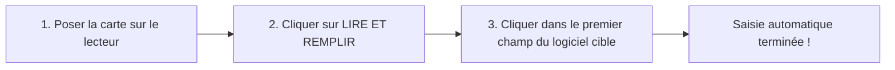

# 🛡️ CNIBE AutoFill - Lecteur Biométrique & Remplisseur Clavier Universel

[](https://www.python.org/)
[](https://pypi.org/project/PyQt6/)
[](https://www.microsoft.com/)
[](https://www.icao.int/)
[](LICENSE)

**CNIBE AutoFill** est une application open-source autonome conçue pour lire les **Cartes Nationales d'Identité Biométriques algériennes (CNIBE TD1)** et les **Passeports biométriques algériens (TD3)** via un lecteur NFC USB standard, et **taper automatiquement les informations dans n'importe quel logiciel ouvert** (émulation clavier matérielle *Keyboard Wedge*).

---

## 🌍 Fonctionne avec N'IMPORTE QUEL logiciel

Grâce à son moteur d'émulation clavier Unicode Windows (`SendInput`), **aucune intégration technique ni API n'est nécessaire** dans vos logiciels cibles :

* 🏥 **Logiciels Médicaux & Cliniques** : logiciels de gestion de cabinet, clinique, laboratoire ou radiologie.
* 📊 **Bureautique** : *Microsoft Word*, *Microsoft Excel*, *Google Docs*, *LibreOffice*.
* 🌐 **Navigateurs Web & Intranets** : *Google Chrome*, *Mozilla Firefox*, *Microsoft Edge* (portails d'inscription, démarches en ligne).
* 🏢 **ERP & Gestion d'Entreprise** : Systèmes de facturation, comptabilité, CRM, logiciels hôteliers, agences d'assurances, études notariales.

---

## ✨ Fonctionnalités Principales

- **⌨️ Émulation Clavier Universelle (Keyboard Wedge)** :
  - Tape les données champ par champ et navigue automatiquement avec la touche `{TAB}` (ou `{ENTRÉE}`).
  - **Support bilingue intégral** : saisie native en **Français** (avec accents) et en **Arabe** sans altération, que votre clavier soit en AZERTY, QWERTY ou Arabe.
- **🎨 Interface Moderne & Ultra-Compacte (PyQt6)** :
  - Thème sombre professionnel *Obsidian & Cyber Cyan*.
  - Barre de titre sombre Windows native.
  - Bouton **`📌 Épingler`** (Always-on-top) avec libération automatique du focus lors du compte à rebours.
  - Bouton **`🔊 Bip`** : activez ou coupez les signaux sonores en un seul clic (mémorisé automatiquement).
- **⚙️ Profils de Formulaires 100% Personnalisables** :
  - Créez de nouveaux profils adaptés à vos logiciels via le bouton **`➕`**.
  - Réorganisez l'ordre des champs (**Monter**, **Descendre**).
  - Activez ou désactivez les champs voulus (**Actif/Inactif**).
  - Insérez des sauts de champ (**Tabulation**) pour franchir des colonnes ou cases inutiles.
  - Réglage précis du délai de frappe (ms) et du décompte (secondes).
- **📁 Mémoire & Cache Sécurisé** :
  - Bouton **`📁 Dernière carte`** : recharge instantanément le numéro de la dernière carte lue et pré-remplit les dates sans ressaisie.
- **🛡️ Sécurité & Conformité ICAO** :
  - Lecture passive certifiée **ICAO Doc 9303 Part 11** (Basic Access Control - BAC) et **ISO 7816-4**.
  - **100% Local** : aucune donnée personnelle n'est envoyée vers des serveurs tiers.

---

## 📋 Données Biométriques Disponibles

L'application peut extraire et injecter l'ensemble des informations suivantes :

| Champ | Description | Exemple |
| :--- | :--- | :--- |
| **N° Carte ID** | Identifiant formaté avec NIN | `Id: 115200000 NIN: 101859636...` |
| **N° Document** | Numéro de la carte seul (9 chiffres) | `115200000` |
| **NIN** | Numéro d'Identification Nationale (18 chiffres) | `101859636000000000` |
| **Nom (Latin)** | Nom de famille en caractères latins | `BENAHMED` |
| **Prénom (Latin)** | Prénom(s) en caractères latins | `MOHAMED` |
| **Nom (Arabe)** | اللقب باللغة العربية | `بن أحمد` |
| **Prénom (Arabe)** | الاسم باللغة العربية | `محمد` |
| **Date de Naissance** | Format paramétrable (JJ/MM/AAAA ou AAAA-MM-JJ) | `15/04/1988` |
| **Lieu de Naissance** | Commune / Wilaya de naissance | `Alger Centre` |
| **Sexe** | Masculin / Féminin ou M / F | `Masculin` |
| **Civilité** | Menu déroulant ou texte | `Monsieur` / `M.` |
| **Situation Familiale** | Célibataire, Marié(e), etc. | `Marié(e)` |
| **Groupe Sanguin** | Rhésus complet | `O+`, `A+`, `B-`... |
| **Adresse** | Domicile / Résidence officielle | `Cité des Martyrs, Batiment 12...` |
| **Date d'Expiration** | Fin de validité du document | `12/10/2032` |
| **Saut de champ** | Touche Tabulation (passer une colonne) | `[TAB]` |

---

## 🔌 Matériel Compatible

Tout lecteur de carte à puce sans contact **PC/SC USB standard** fonctionnant sous Windows :
- **Identiv uTrust 3700 F / 4701 F** *(Recommandé)*
- **ACS ACR122U / ACR1252U**
- **HID Omnikey 5022 / 5422 / 5427**
- Lecteurs intégrés aux claviers ou PC portables professionnels (Dell, HP, Lenovo).

---

## 🚀 Installation & Démarrage Rapide

### Prérequis
1. **Windows 10 ou Windows 11** (64-bit).
2. **Python 3.10 ou 3.11** installé ([python.org](https://www.python.org/downloads/)).  
   *(Pensez à cocher **"Add Python to PATH"** lors de l'installation).*
3. Un lecteur NFC USB branché.

### Démarrage en 1 Clic (Sans configuration)
1. Téléchargez ou clonez ce dépôt :
   ```bash
   git clone https://github.com/bjyoucef/CNIBE-Reader.git
   cd CNIBE-Reader
   ```
2. Double-cliquez simplement sur :
   👉 **`lancer_remplisseur.bat`**

Le script installe automatiquement toutes les dépendances requises (`PyQt6`, `pyscard`, `pycryptodome`) lors du premier lancement, puis ouvre l'interface.

---

## 💡 Mode d'Emploi en 3 Étapes



1. **Posez la carte CNIBE** sur le lecteur NFC USB.
2. Dans l'application, renseignez le N° de carte et dates (ou cliquez sur **`📁 Dernière carte`** pour recharger instantanément la dernière carte mémorisée), puis cliquez sur :
   👉 **`⚡ LIRE ET REMPLIR (3s)`**
3. Dès le premier bip, **cliquez avec votre souris dans le premier champ** de votre logiciel cible (Word, Excel, logiciel médical, ERP...).
4. L'application tape l'ensemble des informations successivement à la vitesse de l'éclair !

---

## ⚙️ Configuration & Profils

Le fichier [autofill_config.json](autofill_config.json) gère les modèles de saisie. Vous pouvez configurer vos profils :
- **Directement dans l'interface** via l'onglet **`⚙️ Champs`** (boutons `➕` pour créer, `⬆`/`⬇` pour ordonner, `💾 Enregistrer`).
- Ou manuellement en éditant le fichier JSON :
  ```json
  {
    "active_profile": "Mon Logiciel",
    "delay_between_fields_ms": 130,
    "countdown_seconds": 3,
    "sound_enabled": true,
    "profiles": { ... }
  }
  ```

---

## 🔒 Confidentialité & Données Privées

Ce projet respecte scrupuleusement la confidentialité et la sécurité des données biométriques :
- **Aucun stockage persistant non consenti** de données nominatives.
- Le fichier `tokens_cache.json` est exclu du contrôle de version (`.gitignore`) pour empêcher toute fuite de données personnelles de citoyens.
- Les communications avec la carte sont chiffrées selon la spécification ICAO BAC (3DES/AES).

---

## 📄 Licence

Ce projet est distribué sous licence **MIT**. Vous êtes libre de l'utiliser, le modifier et l'intégrer dans vos environnements personnels, hospitaliers, associatifs ou commerciaux. Voir le fichier [LICENSE](LICENSE) pour plus de détails.
